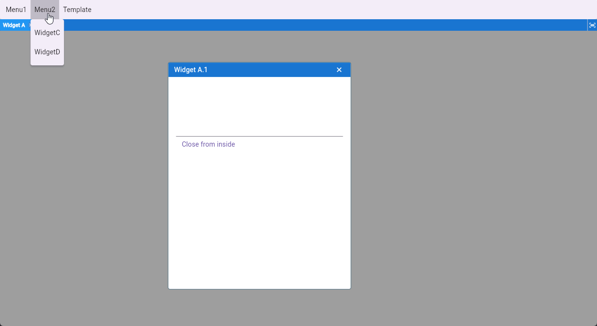

# MDI View for Flutter

A Flutter package that provides a Multiple Document Interface (MDI) experience, allowing you to manage multiple floating, resizable, and maximizable windows within your application.



<p align="center">
  
</p>

## Features

*   **Multiple Windows:** Open and manage multiple windows simultaneously.
*   **Resizable:** Users can resize windows by dragging the edges or corners.
*   **Draggable:** Move windows around the workspace.
*   **Maximizable:** Maximize windows to fill the available space.
*   **Focus Management:** sophisticated focus handling (click to focus, tab navigation support).
*   **Taskbar/Tab Integration:** Built-in tab bar to switch between open windows.
*   **Customizable:** extensive styling options for borders, colors, and metrics.

## Installation

Add `mdi_view` to your `pubspec.yaml`:

```yaml
dependencies:
  mdi_view: ^0.0.1
```

Run `flutter pub get` to install.

## Usage

### 1. Initialize the Controller

Create an instance of `MdiController`. This controller manages the state of all your windows.

```dart
import 'package:flutter/material.dart';
import 'package:mdi_view/mdi_view.dart';

class MyHomePage extends StatefulWidget {
  @override
  _MyHomePageState createState() => _MyHomePageState();
}

class _MyHomePageState extends State<MyHomePage> {
  late MdiController controller;

  @override
  void initState() {
    super.initState();
    controller = MdiController();
    
    // Initialize the controller
    controller.init(); 
  }

  @override
  void dispose() {
    controller.dispose();
    super.dispose();
  }
  
  // ... build method
}
```

### 2. Add the MdiManager Widget

Place the `MdiManager` widget in your build tree, passing the controller you created.

```dart
@override
Widget build(BuildContext context) {
  return Scaffold(
    body: MdiManager(
      controller: controller,
      style: MdiStyleConfiguration(
        mdiBackgroundColor: Colors.grey.shade200,
        windowBackgroundColor: Colors.white,
        borderRadius: 8,
      ),
    ),
  );
}
```

### 3. Open a Window

Use `controller.addWindow` to open a new window. You need to provide a `ParameterWindow` (configuration) and a `child` builder.

```dart
void openNewWindow() {
  controller.addWindow(
    parameter: ParameterWindow(
      title: 'My Window',
      id: 'unique_id_1', // Optional: unique ID
      currentWidth: 300,
      currentHeight: 200,
    ),
    child: (windowController) => Center(
      child: Text('Hello MDI!'),
    ),
  );
}
```

## Customization

You can customize the look and feel using `MdiStyleConfiguration` passed to `MdiManager`.

```dart
MdiManager(
  controller: controller,
  style: MdiStyleConfiguration(
    // Colors
    mdiBackgroundColor: Colors.grey[300]!,
    windowBackgroundColor: Colors.white,
    focusedBorderColor: Colors.blueAccent,
    unfocusedBorderColor: Colors.grey,
    
    // Dimensions
    borderRadius: 10.0,
    borderWidth: 2.0,
    gap: 1.0, // Gap between window content and border
    
    // Tab Bar Styling
    tabBackgroundColor: Colors.blue[800]!,
    focusedTabMenuColor: Colors.blue,
    unfocusedTabMenuColor: Colors.blue[700]!,
  ),
)
```

## Credits

This package is a modernized and optimized version of the original [flutter_app_mdi](https://github.com/achreffaidi/flutter_app_mdi) created by Achref Faidi.

We have updated it to support Flutter 3.x, migrated to Null Safety, and optimized the rendering performance. Huge thanks to the original author for the foundational concepts.

## Contributing

Contributions are welcome! Please feel free to submit a Pull Request.
