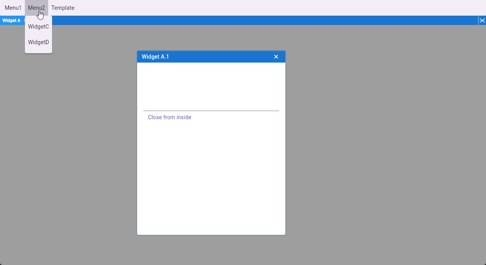

# MDI View for Flutter

A Flutter package that provides a Multiple Document Interface (MDI) experience, allowing you to manage multiple floating, resizable, and maximizable windows within your application. Built with a performance-first architecture, workspace layout persistence, and accessibility.



<p align="center">
  
</p>

## Features

*   **Multiple Windows:** Open and manage multiple windows simultaneously.
*   **Performance-First Architecture:** Subtree rendering caching (via controller widget caching) completely eliminates layout thrashing and unnecessary chrome repaints when shifting window Z-order or layouts.
*   **Seamless Draggable Body & Child Gesture Bypass:** Window bodies can be dragged from empty/background areas (`draggableBody: true`) while automatically bypassing interactive child widgets (Sliders, TextFields, ListViews, custom drag gestures, and pointer listeners).
*   **Workspace Scroll & Shift+Scroll Delegation:** Mouse wheel and trackpad scroll over empty space, Cards, Containers, or headers smoothly scrolls the parent MDI workspace. Holding `Shift` scrolls the workspace horizontally.
*   **Workspace Persistence & Diff Reconciliation:** Export layout configurations to a JSON-compatible format. Restoring layout uses diff reconciliation to modify active window positions in-place, preserving input state, text selections, and scroll positions.
*   **Magnetic Edge Snapping:** Dragging or resizing window borders close to canvas boundaries or sibling window edges (within 12px) snaps them flush automatically.
*   **Cross-Platform Keyboard Accessibility:** Fully navigable using native desktop shortcuts with fallback alternatives for web builds where standard hotkeys are browser-reserved.
*   **Resizable & Draggable:** Free-form dragging and boundary/corner resizing.
*   **Maximizable:** Toggle maximizing windows to fill the MDI canvas.
*   **Focus Management:** Sophisticated Z-order focus promoting (click-to-focus and tab strip navigation).
*   **Taskbar/Tab Integration:** Horizontal reorderable tabs showing open documents.

## Installation

Add `mdi_view` to your `pubspec.yaml`:

```yaml
dependencies:
  mdi_view: ^0.1.0
```

Run `flutter pub get` to install.

## Usage

### 1. Initialize the Controller

Create an instance of `MdiController` to manage MDI states, scroll behaviors, and window registries.

```dart
import 'package:flutter/material.dart';
import 'package:mdi_view/mdi_view.dart';

class MyHomePage extends StatefulWidget {
  const MyHomePage({super.key});

  @override
  _MyHomePageState createState() => _MyHomePageState();
}

class _MyHomePageState extends State<MyHomePage> {
  late MdiController controller;

  @override
  void initState() {
    super.initState();
    controller = MdiController();
    controller.init(); 
  }

  @override
  void dispose() {
    controller.dispose();
    super.dispose();
  }
}
```

### 2. Add the MdiManager Widget

Mount the MDI canvas in your build tree.

```dart
@override
Widget build(BuildContext context) {
  return Scaffold(
    body: MdiManager(
      controller: controller,
      style: MdiStyleConfiguration(
        mdiBackgroundColor: Colors.grey.shade200,
        windowBackgroundColor: Colors.white,
        borderRadius: 8,
      ),
    ),
  );
}
```

### 3. Open a Window

```dart
void openNewWindow() {
  controller.addWindow(
    parameter: ParameterWindow(
      title: 'Document 1',
      id: 'unique_id_1',
      currentWidth: 300,
      currentHeight: 200,
    ),
    child: (windowController) => Center(
      child: Text('Hello MDI!'),
    ),
  );
}
```

---

## Layout Persistence & Diff Reconciliation

Serialize your workspace layout to JSON and reconstruct it cleanly without resetting active widget states.

### Saving Workspace Layout
```dart
List<Map<String, dynamic>> savedLayout = controller.exportLayout();
// This list can be converted to JSON and stored locally or in databases.
```

### Restoring Workspace Layout (Diff Reconciliation)
```dart
controller.importLayout(
  savedLayout,
  childBuilder: (ParameterWindow parameter) {
    // Reconstruct the child based on parameters (e.g. title, ID, or arguments)
    if (parameter.title == 'Calculator') {
      return MyCalculator();
    }
    return MyTextEditor();
  },
);
```

---

## Keyboard Shortcuts & Accessibility

`mdi_view` listens to focus traversal hotkeys to cycle or close active documents:

| Action | Desktop Build (Native Windows/macOS/Linux) | Web Build (Chrome/Firefox/Safari/Edge) |
|---|---|---|
| **Cycle Focus Next** | `Ctrl + Tab` or `Ctrl + Alt + ArrowRight` | `Ctrl + .` (Period) or `Ctrl + Alt + ArrowRight` |
| **Cycle Focus Previous** | `Ctrl + Shift + Tab` or `Ctrl + Alt + ArrowLeft` | `Ctrl + ,` (Comma) or `Ctrl + Alt + ArrowLeft` |
| **Close Active Window** | `Ctrl + W` or `Ctrl + F4` | `Alt + W` |

---

## Draggable Window Body & Workspace Scrolling

### Draggable Body with Automatic Gesture Bypass
By default (`draggableBody: true`), windows can be dragged from the title bar header as well as any empty/background area of the window body.

Interactive child widgets are automatically detected and protected from accidental window drags:
* **Sliders & Controls**: Built-in `Slider`, `RangeSlider`, and custom components containing `Thumb`, `Track`, `Scrollbar`, or `Knob` in their render objects.
* **Scrollables**: `ListView`, `GridView`, `SingleChildScrollView`, and all custom viewports.
* **Text Inputs**: `TextField`, `TextFormField`, and editable text render objects.
* **Custom Gestures**: Any child widget with active horizontal/vertical drag callbacks or raw pointer movement listeners (`RenderPointerListener.onPointerMove`).
* **Explicit Exclusions**: Wrap custom widgets with `IgnoreWindowDrag(child: ...)` or provide a custom predicate via `MdiStyleConfiguration.shouldIgnoreDragTarget`.

### Workspace Scroll & Shift+Scroll Delegation
* Scrolling the mouse wheel over non-scrollable areas inside a window (empty background space, Cards, Containers, or the window header) will scroll the parent MDI canvas vertically.
* Inner scrollable widgets (e.g. `ListView`) retain full isolation and consume scroll events locally.
* Holding **Shift** while rolling the mouse wheel over non-scrollable window areas smoothly scrolls the MDI workspace horizontally.

---

## Customization

Style configurations can be adjusted via `MdiStyleConfiguration`:

```dart
MdiManager(
  controller: controller,
  style: MdiStyleConfiguration(
    // Surface colours
    mdiBackgroundColor: Colors.grey[300]!,
    windowBackgroundColor: Colors.white,
    focusedBorderColor: Colors.blueAccent,
    unfocusedBorderColor: Colors.grey,
    
    // Layout geometry
    borderRadius: 10.0,
    borderWidth: 2.0,
    gap: 1.0, 
    
    // Tabs styling
    tabBackgroundColor: Colors.blue[800]!,
    focusedTabMenuColor: Colors.blue,
    unfocusedTabMenuColor: Colors.blue[700]!,
  ),
)
```

## Credits

This package is a modernized and optimized version of the original [flutter_app_mdi](https://github.com/achreffaidi/flutter_app_mdi) created by Achref Faidi.

## Contributing

Contributions are welcome! Please feel free to submit a Pull Request.
